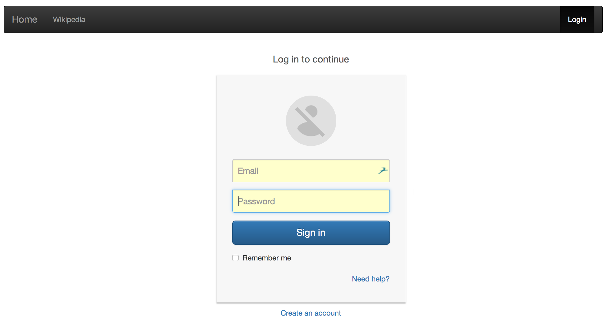
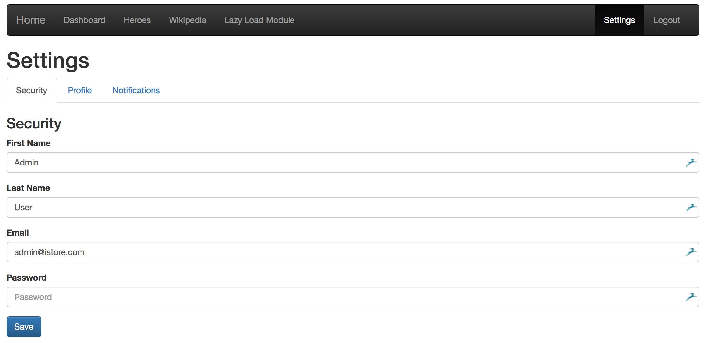
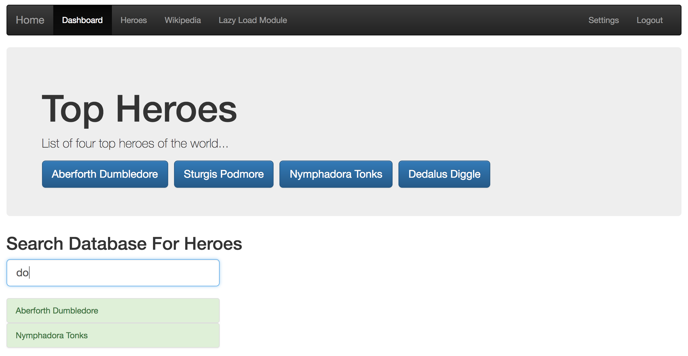
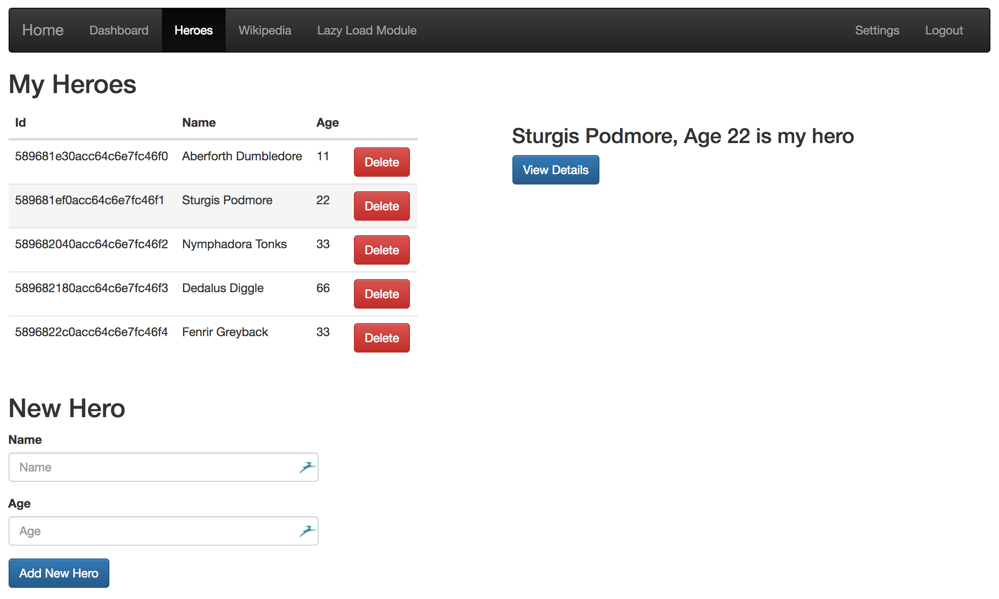

# MEAN Starter Kit using Docker Compose

> This project is based on ideas from the sites linked to in the [References](#references) section but simplified for the purpose of quickly starting up a project and customizing it for a general purpose website

## Features
- Bootstrap 3
- Angular 2 with Webpack 2.x using angular-cli
- Eager and lazy routing as well as child routings
- template-driven and model-driven (Reactive) forms using FormBuilder and Validators
- Authentication using JSON Web Tokens (JWT), user registration and password reset
- Email using Nodemailer that's compatible with most SMTP and cloud email providers for password reset purpose
- Multi tabs interface for user settings
- MongoDB data access using Mongoose and initial user account seeding using mongoimport
- Node.js with Express

## Development without using Docker
To do local development without using Docker, make sure the following software are installed.
- [MongoDB](https://www.mongodb.com)
- [Node](https://nodejs.org)

### Usages
- Make sure the MongoDB server is running and listening on localhost port 27017. If your server is running somewhere else or listening on other port, don't forget to update the 'database' value in the './mean-docker/server/config.js' file
- Run the './seed.sh' or './seed.cmd' script depending on if you're using Mac/Linux or Windows machine to seed your MongoDB database with an 'Admin' and 'Demo' users. Use the info below to login to the 'client' site:
    - User: admin@company.com, Password: admin
    - User: demo@company.com, Password: demo
- Open up two command-line interfaces and change to the "client" and "server" folders respectively then enter "npm start" to run both the client and server apps
```console
cd ./mean-docker/client
npm start

cd ./mean-docker/server
npm start
```
- After the above steps, there will be two web sites running on your machine. The 'client' site will be on port 4200 and the 'server' site on 3000

## Using Docker
Once all development are done, you can use Docker Compose to deploy services into containers. Make sure you install the Docker software at the link below. On Mac, install 'Docker for Mac'. On Windows, install 'Docker for Windows'. On Linux, install 'Docker Engine' for your specific Linux distribution
- [Docker](https://docs.docker.com/engine/installation)

### Usages
- Builds, creates, starts all services in the foreground for debugging purpose
```console
docker-compose up
```

- Builds, creates, starts all services in the background
```console
docker-compose up -d
```

- Stops, removes all services
```console
docker-compose down
```

- Rebuild all the services and starts them
```console
docker-compose up -d --build
```

- Rebuild a single service and start it
```console
docker-compose up -d --no-deps --build <service_name>
```

## References
- https://scotch.io/tutorials/create-a-mean-app-with-angular-2-and-docker-compose
- http://jasonwatmore.com/post/2016/04/05/angularjs-jwt-authentication-example-tutorial
- https://github.com/AngularClass/angular2-webpack-starter
- https://jwt.io

## Screenshots




